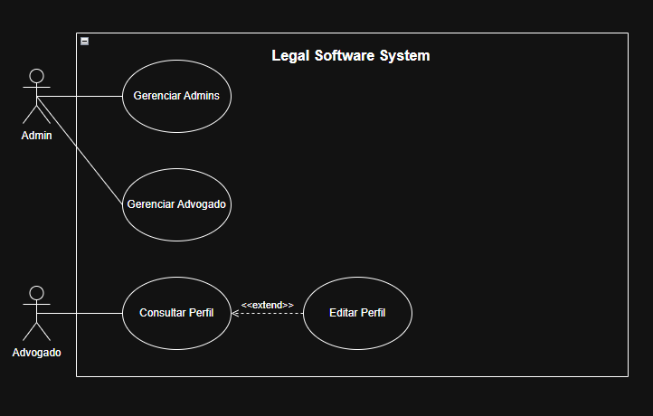

# Legal Software System

**Sistema Jurídico** — Aplicação para gerenciar usuários, processos e documentação jurídica

Projeto da disciplina **Métodos de Projeto de Software** do Professor Raoni

## Participantes

- Antônio Augusto Dantas Neto - 20230012215
- Deivily Breno Silva Carneiro - 20230012734
- Lucas Gabriel Fontes da Silva - 20230012592
- Rafael de França Silva - 20230012654
- Reuben Lisboa Ramalho Claudino - 20210024602
- Tobias Freire Numeriano - 20230012378

## Tecnologias Utilizadas

- **Java 21** — Linguagem de programação
- **Spring Boot 3.5.11** — Framework web
- **Spring Data JPA** — Persistência de dados
- **PostgreSQL 15** — Banco de dados relacional
- **Flyway** — Migrations de banco de dados
- **Lombok** — Redução de boilerplate
- **Maven 3.8+** — Gerenciador de dependências
- **Docker** — Containerização do banco de dados

## Padrões de Projeto Implementados

- **Façade** — `FacadeSingletonController` centraliza o acesso à camada de negócio
- **Command** — Cada operação da fachada é encapsulada em um objeto `Command`; o `CommandInvoker` realiza a execução desacoplada
- **Memento** — Permite desfazer a última atualização de um usuário; `User` é o Originator, `UserMemento` o snapshot e `UserMementoCaretaker` o guardião do histórico
- **Template Method** — `ReportGeneratorTemplate` define o esqueleto da geração de relatórios; `HtmlAccessReport` e `PdfAccessReport` implementam os passos variáveis
- **Abstract Factory** — `RepositoryFactory` abstrai a criação dos repositórios, mantendo o domínio desacoplado da infraestrutura JPA
- **Adapter** — `Slf4jLoggerAdapter` adapta o SLF4J à interface de domínio `ILogger`

## Diagramas

### Diagrama de Casos de Uso - Gerenciar Usuários


### Diagrama de Classes


## Pré-requisitos

### Software Obrigatório
- **Java Development Kit (JDK) 21+**
  - Download: https://www.oracle.com/java/technologies/downloads/#java21
  - Verifique com: `java -version`

- **Maven 3.8+**
  - Download: https://maven.apache.org/download.cgi
  - Verifique com: `mvn -version`

- **Docker Desktop**
  - Download: https://www.docker.com/products/docker-desktop
  - Verifique com: `docker --version`

## Configuração Inicial

### 1. Clone o Repositório
```powershell
git clone https://github.com/ReubenRamalho/Legal-Software-System.git
cd Legal-Software-System
```

### 2. Inicie o Banco de Dados PostgreSQL

O projeto inclui um arquivo `docker-compose.yml` para facilitar o setup do PostgreSQL.

```powershell
# Inicie o container PostgreSQL em background
docker-compose up -d

# Verifique se o PostgreSQL está rodando
docker-compose ps
```

**Credenciais padrão:**
- Host: `localhost`
- Port: `5432`
- Database: `db_mps`
- User: `user`
- Password: `password`

### 3. Compile o Projeto
```powershell
mvn clean compile
```

## Como Executar

### Iniciar a Aplicação
```powershell
mvn spring-boot:run
```

### Saída de Sucesso
```
==================================================
  SISTEMA JURÍDICO INICIADO COM SUCESSO!  
==================================================

=== MENU PRINCIPAL ===
1. Criar Usuário
2. Criar Processo
3. Listar Todos os Usuários
4. Buscar Usuário por ID
5. Atualizar Usuário
6. Remover Usuário
7. Contar Total de Entidades
8. Gerar Relatório de Acessos
9. Desfazer Última Atualização de Usuário
10. Sair
Escolha uma opção:
```

## Guia de Uso do Menu CLI

### Opção 1: Criar Usuário

Cria um novo usuário no sistema com validações obrigatórias.

**Validações:**
- **Nome**: Nome completo do usuário
- **Email**: Campo obrigatório (qualquer formato não-vazio)
- **Tipo**: Categoria do usuário (um dos valores: "Sócio-Administrador", "Sócio", "Advogado", "Estagiário")
- **Login**: Identificador único, máximo 12 caracteres, somente letras
- **Senha**: 8-128 caracteres, deve conter **pelo menos 3 dos 4 tipos**:
  - Letras maiúsculas (A-Z)
  - Letras minúsculas (a-z)
  - Números (0-9)
  - Caracteres especiais (!@#$%&*)

**Exemplo de uso:**
```
Escolha uma opção: 1

--- Novo Usuário ---
Nome: Ana Carolina Mendes
Email: ana.mendes@advocacia.com.br
Tipo (Sócio-Administrador, Sócio, Advogado, Estagiário): Advogado
Login: anacarol
Senha: Justiça@2026
[OK] Usuário criado com sucesso!
```

### Opção 2: Criar Processo

Cria um novo processo jurídico com informações detalhadas.

**Campos:**
- **Número CNJ**: Número de identificação do processo (Conselho Nacional de Justiça)
- **Título**: Título descritivo do processo
- **Descrição**: Detalhes do caso jurídico
- **Nome do Cliente**: Nome da pessoa física ou jurídica envolvida
- **Vara (Court)**: Vara judicial responsável
- **Distrito (District)**: Distrito judiciário
- **IDs dos Advogados**: IDs dos advogados responsáveis (separados por vírgula ou deixe em branco)

**Exemplo de uso:**
```
Escolha uma opção: 2

--- Novo Processo ---
Número CNJ: 0000123-45.2026.1.21.3500
Título: Ação Civil de Cobrança
Descrição: Ação de cobrança de débito relacionado a serviços prestados
Nome do Cliente: Empresa Tech Solutions Ltda
Vara (Court): Vara de Execuções e Causas Especiais
Distrito (District): Fortaleza
IDs dos Advogados (separados por vírgula ou deixe em branco): 9f3dc492-a867-41f5-a137-9619be49d4a2
[OK] Processo criado com sucesso!
```

### Opção 3: Listar Todos os Usuários

Exibe uma lista com todos os usuários cadastrados no sistema.

**Informações exibidas:** ID (UUID), Nome e Tipo (categoria do usuário).

**Exemplo de uso:**
```
Escolha uma opção: 3

--- Lista de Usuários ---
- 9f3dc492-a867-41f5-a137-9619be49d4a2: Carlos Pereira (Tipo: Sócio-Administrador)
- 535a027c-b3ee-40e1-bd6f-a4845e7caea4: Mariana Costa (Tipo: Sócio)
- 1c7bf4cb-4a87-4748-9f9f-d9a736e5e6b4: Ana Carolina Mendes (Tipo: Advogado)
```

### Opção 4: Buscar Usuário por ID

Localiza e exibe os dados de um usuário específico pelo seu UUID.

**Exemplo de uso:**
```
Escolha uma opção: 4

--- Buscar Usuário por ID ---
ID do usuário: 9f3dc492-a867-41f5-a137-9619be49d4a2
Usuário encontrado:
- ID: 9f3dc492-a867-41f5-a137-9619be49d4a2
- Nome: Carlos Pereira
- Tipo: Sócio-Administrador
```

### Opção 5: Atualizar Usuário

Atualiza os campos de um usuário existente. Deixe um campo em branco para mantê-lo inalterado.

**Exemplo de uso:**
```
Escolha uma opção: 5

--- Atualizar Usuário ---
(Deixe em branco para manter o valor atual)
ID do usuário: 9f3dc492-a867-41f5-a137-9619be49d4a2
Novo nome: Carlos Augusto Pereira
Novo email:
Novo tipo (Sócio-Administrador, Sócio, Advogado, Estagiário):
Novo login:
Nova senha:
[OK] Usuário atualizado com sucesso!
```

### Opção 6: Remover Usuário

Remove permanentemente um usuário do sistema pelo seu UUID.

**Exemplo de uso:**
```
Escolha uma opção: 6

--- Remover Usuário ---
ID do usuário: 1c7bf4cb-4a87-4748-9f9f-d9a736e5e6b4
[OK] Usuário removido com sucesso!
```

### Opção 7: Contar Total de Entidades

Mostra a quantidade total de usuários e processos cadastrados no banco de dados.

**Exemplo de uso:**
```
Escolha uma opção: 7

--- Contagem de Entidades ---
Total de entidades (Usuários + Processos) registradas no banco: 6
```

### Opção 8: Gerar Relatório de Acessos

Gera um relatório dos acessos ao sistema nos últimos 30 dias no formato escolhido (HTML ou PDF). O arquivo é salvo automaticamente em `reports/html/` ou `reports/pdf/`.

**Exemplo de uso:**
```
Escolha uma opção: 8

--- Gerar Relatório de Acessos ---
Formato desejado (HTML ou PDF): HTML
Gerando relatório para o período: 2026-02-26 a 2026-03-27...
[OK] Relatório gerado com sucesso!
O arquivo foi salvo em: /caminho/para/reports/html/relatorio_1743000000000.html
```

### Opção 9: Desfazer Última Atualização de Usuário

Reverte o último **update** realizado em um usuário, restaurando o estado anterior à modificação. Implementa o padrão **Memento**.

> **Atenção:** Só é possível desfazer a atualização mais recente. Após o desfazimento, o histórico é limpo e a operação não pode ser repetida.

**Exemplo de uso:**
```
Escolha uma opção: 9

--- Desfazer Última Atualização de Usuário ---
ID do usuário: 9f3dc492-a867-41f5-a137-9619be49d4a2
[OK] Última atualização desfeita com sucesso!
```

### Opção 10: Sair

Encerra a aplicação.

```
Escolha uma opção: 10

Encerrando o sistema. Até logo!
```
