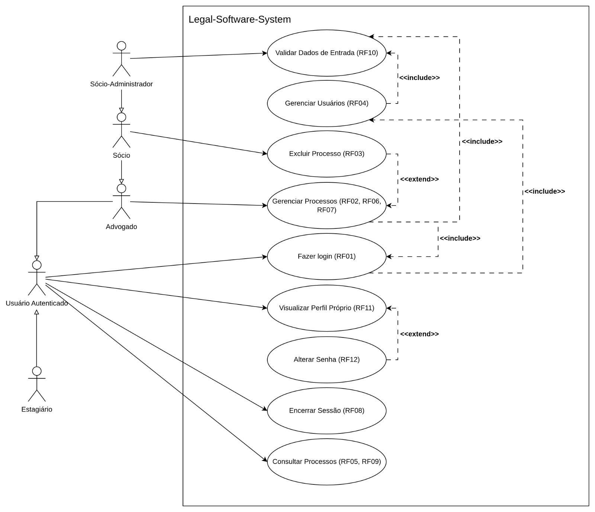
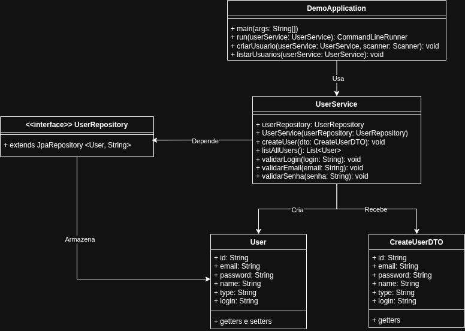

# Legal Software System

**Sistema Jurídico** — Aplicação para gerenciar usuários, processos e documentação jurídica

Projeto da disciplina **Métodos de Projeto de Software** do Professor Raoni

## Participantes

- Antônio Augusto Dantas Neto - 20230012215
- Deivily Breno Silva Carneiro - 20230012734
- Lucas Gabriel Fontes da Silva - 20230012592
- Rafael de França Silva - 20230012654
- Reuben Lisboa Ramalho Claudino - 20210024602
- Tobias Freire Numeriano - 20230012378

## Tecnologias Utilizadas

- **Java 21** — Linguagem de programação
- **Spring Boot 3.5.11** — Framework web
- **Spring Data JPA** — Persistência de dados
- **PostgreSQL 15** — Banco de dados relacional
- **Flyway** — Migrations de banco de dados
- **Lombok** — Redução de boilerplate
- **Maven 3.8+** — Gerenciador de dependências
- **Docker** — Containerização do banco de dados

## Pré-requisitos

- **JDK 21+** → `java -version`
- **Maven 3.8+** → `mvn -version`
- **Docker** → `docker --version`

## Como Rodar o Projeto

### 1. Clone o repositório

```bash
git clone https://github.com/ReubenRamalho/Legal-Software-System.git
cd Legal-Software-System
```

### 2. Suba o banco de dados PostgreSQL

```bash
docker-compose up -d
```

**Credenciais padrão:** Host `localhost:5432` | Database `db_mps` | User `user` | Password `password`

### 3. Compile o projeto

```bash
mvn clean compile
```

### 4. Execute a aplicação

```bash
mvn spring-boot:run
```

A aplicação irá iniciar e exibir o menu interativo no terminal.

## Estrutura do Projeto

```
src/main/java/com/example/legal_system/
├── controller/          # FacadeSingletonController e Commands
│   └── command/         # Command, CommandInvoker e implementações
├── domain/              # Interfaces de repositório, RepositoryFactory e ProcessObserver
├── dto/                 # Data Transfer Objects (records)
├── enums/               # UserType e StatusProcess
├── infrastructure/
│   ├── log/             # Slf4jLoggerAdapter (Adapter)
│   └── persistence/     # JpaRepositoryFactory e implementações JPA
├── memento/             # UserMemento e UserMementoCaretaker
├── model/               # Entidades JPA (User, Process, Access)
├── service/             # Serviços de negócio e Template Method
│   ├── observer/        # AuditLogObserver e AccessRecordObserver (Observer)
│   └── strategy/        # PasswordValidationStrategy e implementações (Strategy)
└── view/                # MenuCLIView (interface CLI)
```

## Diagramas

### Diagrama de Casos de Uso - Gerenciar Usuários


### Diagrama de Classes (PENDENTE DE ATUALIZAÇÃO)



## Padrões de Projeto Utilizados

### 1. Façade

Centraliza o acesso à camada de negócio através de uma única classe controladora.

**Arquivos:**
- [`FacadeSingletonController.java`](src/main/java/com/example/legal_system/controller/FacadeSingletonController.java) — Fachada que recebe as requisições da View e delega para os Services via Commands

```java
@Component
public class FacadeSingletonController {
    private final UserService userService;
    private final ProcessService processService;
    private final AccessReportService accessReportService;
    private final CommandInvoker invoker;

    public void createUser(CreateUserDTO dto) {
        invoker.invoke(new CreateUserCommand(userService, dto));
    }
    // ...
}
```

---

### 2. Command

Cada operação é encapsulada em um objeto Command; o CommandInvoker realiza a execução desacoplada.

**Arquivos:**
- [`Command.java`](src/main/java/com/example/legal_system/controller/command/Command.java) — Interface base
- [`CommandInvoker.java`](src/main/java/com/example/legal_system/controller/command/CommandInvoker.java) — Invocador
- [`CreateUserCommand.java`](src/main/java/com/example/legal_system/controller/command/user/CreateUserCommand.java)
- [`FindAllUsersCommand.java`](src/main/java/com/example/legal_system/controller/command/user/FindAllUsersCommand.java)
- [`FindOneUserCommand.java`](src/main/java/com/example/legal_system/controller/command/user/FindOneUserCommand.java)
- [`UpdateUserCommand.java`](src/main/java/com/example/legal_system/controller/command/user/UpdateUserCommand.java)
- [`UndoUpdateUserCommand.java`](src/main/java/com/example/legal_system/controller/command/user/UndoUpdateUserCommand.java)
- [`RemoveUserCommand.java`](src/main/java/com/example/legal_system/controller/command/user/RemoveUserCommand.java)
- [`CreateProcessCommand.java`](src/main/java/com/example/legal_system/controller/command/process/CreateProcessCommand.java)
- [`CountEntitiesCommand.java`](src/main/java/com/example/legal_system/controller/command/process/CountEntitiesCommand.java)
- [`GenerateAccessReportCommand.java`](src/main/java/com/example/legal_system/controller/command/report/GenerateAccessReportCommand.java)

```java
public interface Command<T> {
    T execute();
}

public class CreateUserCommand implements Command<Void> {
    private final UserService userService;
    private final CreateUserDTO dto;

    @Override
    public Void execute() {
        userService.create(dto);
        return null;
    }
}

public class CommandInvoker {
    public <T> T invoke(Command<T> command) {
        return command.execute();
    }
}
```

---

### 3. Memento

Permite desfazer a última atualização de um usuário. `User` é o Originator, `UserMemento` o snapshot imutável e `UserMementoCaretaker` o guardião do histórico.

**Arquivos:**
- [`User.java`](src/main/java/com/example/legal_system/model/User.java) — Originator (cria e restaura mementos)
- [`UserMemento.java`](src/main/java/com/example/legal_system/memento/UserMemento.java) — Snapshot imutável do estado
- [`UserMementoCaretaker.java`](src/main/java/com/example/legal_system/memento/UserMementoCaretaker.java) — Armazena o último memento por usuário

```java
// Originator — User.java
public UserMemento createMemento() {
    return new UserMemento(id, name, email, type, login, password);
}

public void restoreFromMemento(UserMemento memento) {
    this.name     = memento.getName();
    this.email    = memento.getEmail();
    this.type     = memento.getType();
    this.login    = memento.getLogin();
    this.password = memento.getPassword();
}

// Caretaker — UserMementoCaretaker.java
@Component
public class UserMementoCaretaker {
    private final Map<String, UserMemento> history = new HashMap<>();

    public void save(UserMemento memento) {
        history.put(memento.getId(), memento);
    }

    public Optional<UserMemento> getLast(String userId) {
        return Optional.ofNullable(history.get(userId));
    }

    public void clear(String userId) {
        history.remove(userId);
    }
}
```

---

### 4. Template Method

`ReportGeneratorTemplate` define o esqueleto fixo da geração de relatórios (extrair → processar → formatar → salvar); `HtmlAccessReport` e `PdfAccessReport` implementam os passos variáveis.

**Arquivos:**
- [`ReportGeneratorTemplate.java`](src/main/java/com/example/legal_system/service/ReportGeneratorTemplate.java) — Classe abstrata com o Template Method
- [`HtmlAccessReport.java`](src/main/java/com/example/legal_system/service/HtmlAccessReport.java) — Geração em HTML
- [`PdfAccessReport.java`](src/main/java/com/example/legal_system/service/PdfAccessReport.java) — Geração em PDF

```java
public abstract class ReportGeneratorTemplate {

    public final String generateReport(LocalDate startDate, LocalDate endDate) {
        List<AccessRecordDTO> rawData = extractData(startDate, endDate);     // passo fixo
        AccessStatisticsDTO statistics = processStatistics(rawData);          // passo fixo
        byte[] formattedReport = formatOutput(statistics);                   // passo variável
        return save(formattedReport);                                        // passo variável
    }

    protected abstract byte[] formatOutput(AccessStatisticsDTO statistics);
    protected abstract String save(byte[] formattedReport);
}

@Component("HTML")
public class HtmlAccessReport extends ReportGeneratorTemplate { /* ... */ }

@Component("PDF")
public class PdfAccessReport extends ReportGeneratorTemplate { /* ... */ }
```

---

### 5. Abstract Factory

`RepositoryFactory` abstrai a criação dos repositórios, e `JpaRepositoryFactory` fornece as implementações JPA concretas. O domínio permanece desacoplado da infraestrutura.

**Arquivos:**
- [`RepositoryFactory.java`](src/main/java/com/example/legal_system/domain/RepositoryFactory.java) — Interface da fábrica abstrata
- [`JpaRepositoryFactory.java`](src/main/java/com/example/legal_system/infrastructure/persistence/JpaRepositoryFactory.java) — Implementação concreta JPA

```java
public interface RepositoryFactory {
    IUserRepository getUserRepository();
    IProcessRepository getProcessRepository();
    IAccessRepository getAccessRepository();
}

@Component
public class JpaRepositoryFactory implements RepositoryFactory {
    private final IUserRepository userRepository;
    private final IProcessRepository processRepository;
    private final IAccessRepository accessRepository;

    @Override
    public IUserRepository getUserRepository() { return userRepository; }
    @Override
    public IProcessRepository getProcessRepository() { return processRepository; }
    @Override
    public IAccessRepository getAccessRepository() { return accessRepository; }
}
```

---

### 6. Adapter

`Slf4jLoggerAdapter` adapta o framework SLF4J à interface de domínio `ILogger`, mantendo a camada de negócio desacoplada de qualquer biblioteca de logging.

**Arquivos:**
- [`ILogger.java`](src/main/java/com/example/legal_system/domain/ILogger.java) — Interface de domínio
- [`Slf4jLoggerAdapter.java`](src/main/java/com/example/legal_system/infrastructure/log/Slf4jLoggerAdapter.java) — Adapter para SLF4J

```java
public interface ILogger {
    void info(String message);
    void warn(String message);
    void error(String message, Throwable throwable);
}

@Component
public class Slf4jLoggerAdapter implements ILogger {
    private final Logger logger = LoggerFactory.getLogger(Slf4jLoggerAdapter.class);

    @Override
    public void info(String message) { logger.info(message); }

    @Override
    public void warn(String message) { logger.warn(message); }

    @Override
    public void error(String message, Throwable throwable) { logger.error(message, throwable); }
}
```

---

### 7. Observer

Notifica partes interessadas sempre que o status de um processo jurídico é alterado. `ProcessObserver` é a interface; `ProcessStatusNotifier` é o Subject gerenciado pelo Spring; `AuditLogObserver` e `AccessRecordObserver` são os Observers concretos.

**Arquivos:**
- [`ProcessObserver.java`](src/main/java/com/example/legal_system/domain/ProcessObserver.java) — Interface do Observer
- [`ProcessStatusNotifier.java`](src/main/java/com/example/legal_system/service/ProcessStatusNotifier.java) — Subject: mantém a lista de observers e dispara as notificações
- [`AuditLogObserver.java`](src/main/java/com/example/legal_system/service/observer/AuditLogObserver.java) — Observer concreto: registra a transição de status no log
- [`AccessRecordObserver.java`](src/main/java/com/example/legal_system/service/observer/AccessRecordObserver.java) — Observer concreto: persiste um registro de acesso quando o processo é encerrado
- [`ProcessService.java`](src/main/java/com/example/legal_system/service/ProcessService.java) — Originator: chama `notifier.notifyObservers()` após a mudança de status
- [`UpdateProcessStatusCommand.java`](src/main/java/com/example/legal_system/controller/command/process/UpdateProcessStatusCommand.java) — Command que encapsula a operação

```java
// Observer interface
public interface ProcessObserver {
    void onProcessStatusChanged(Process process, StatusProcess oldStatus);
}

// Subject — Spring injeta automaticamente todos os beans ProcessObserver
@Component
public class ProcessStatusNotifier {
    private final List<ProcessObserver> observers;

    public void notifyObservers(Process process, StatusProcess oldStatus) {
        for (ProcessObserver observer : observers) {
            observer.onProcessStatusChanged(process, oldStatus);
        }
    }
}

// Observer concreto — loga a transição
@Component
public class AuditLogObserver implements ProcessObserver {
    @Override
    public void onProcessStatusChanged(Process process, StatusProcess oldStatus) {
        logger.info("[AUDIT] " + oldStatus + " → " + process.getStatus());
    }
}

// Observer concreto — persiste acesso de auditoria ao fechar o processo
@Component
public class AccessRecordObserver implements ProcessObserver {
    @Override
    public void onProcessStatusChanged(Process process, StatusProcess oldStatus) {
        if (process.getStatus() == StatusProcess.CLOSED) {
            accessRepository.save(Access.create("SYSTEM", LocalDateTime.now(), "PROCESS_CLOSED"));
        }
    }
}
```

---

### 8. Strategy

Política de validação de senha intercambiável por tipo de usuário. `PasswordValidationStrategy` é a interface; `StrictPasswordStrategy`, `StandardPasswordStrategy` e `BasicPasswordStrategy` são as estratégias concretas; `PasswordStrategyFactory` seleciona a correta em tempo de execução; `UserValidatorService` delega a validação sem conhecer qual regra será aplicada.

**Arquivos:**
- [`PasswordValidationStrategy.java`](src/main/java/com/example/legal_system/service/strategy/PasswordValidationStrategy.java) — Interface da estratégia
- [`StrictPasswordStrategy.java`](src/main/java/com/example/legal_system/service/strategy/StrictPasswordStrategy.java) — 4/4 tipos de complexidade, mín. 12 chars (`SOCIO_ADMINISTRADOR`)
- [`StandardPasswordStrategy.java`](src/main/java/com/example/legal_system/service/strategy/StandardPasswordStrategy.java) — 3/4 tipos, mín. 8 chars (`SOCIO`, `ADVOGADO`)
- [`BasicPasswordStrategy.java`](src/main/java/com/example/legal_system/service/strategy/BasicPasswordStrategy.java) — 2/4 tipos, mín. 6 chars (`ESTAGIARIO`)
- [`PasswordStrategyFactory.java`](src/main/java/com/example/legal_system/service/strategy/PasswordStrategyFactory.java) — Seleciona a estratégia pelo `UserType`
- [`UserValidatorService.java`](src/main/java/com/example/legal_system/service/UserValidatorService.java) — Usa a estratégia sem depender das implementações concretas

```java
// Interface da estratégia
public interface PasswordValidationStrategy {
    void validate(String password, String login, String email);
}

// Factory: mapeia UserType → Strategy
@Component
public class PasswordStrategyFactory {
    public PasswordValidationStrategy getStrategy(UserType userType) {
        return switch (userType) {
            case SOCIO_ADMINISTRADOR -> new StrictPasswordStrategy();   // 4/4, min 12
            case SOCIO, ADVOGADO    -> new StandardPasswordStrategy();  // 3/4, min 8
            case ESTAGIARIO         -> new BasicPasswordStrategy();     // 2/4, min 6
        };
    }
}

// UserValidatorService: delega sem conhecer qual regra será aplicada
private void validatePassword(String password, String login, String email, UserType userType) {
    PasswordValidationStrategy strategy = passwordStrategyFactory.getStrategy(userType);
    strategy.validate(password, login, email);
}
```
